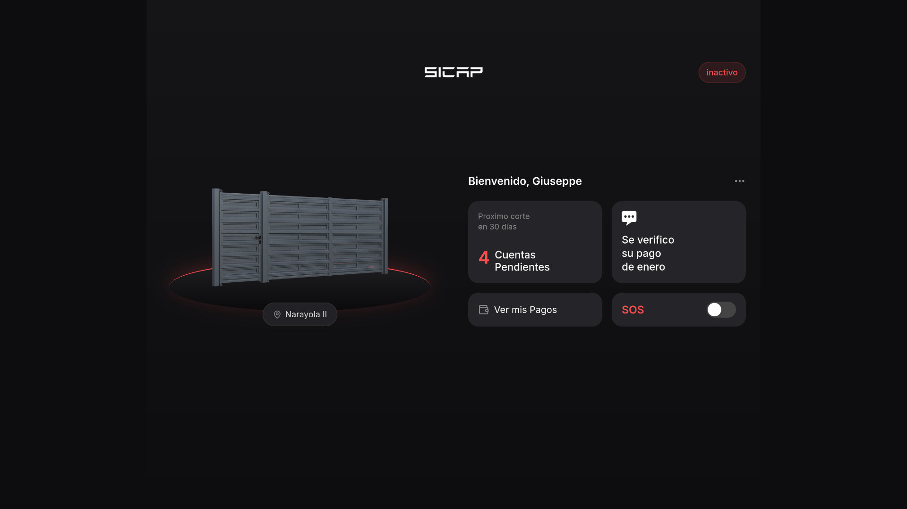
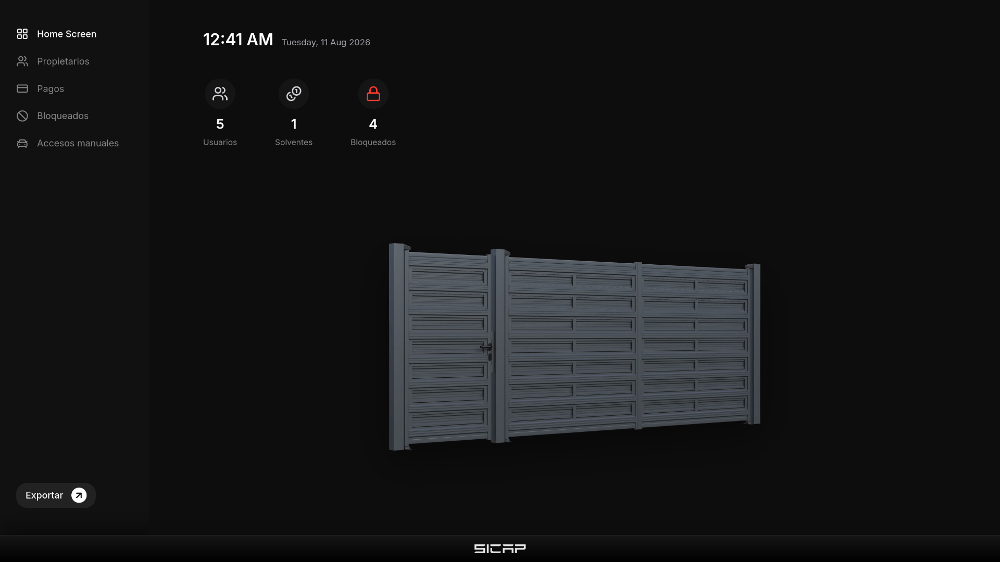
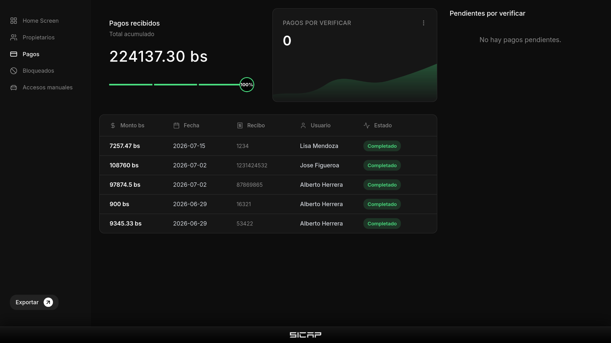

<p align="center">  </p>

<p align="center"> <strong>Gate Access Control System</strong> </p>

## Description

SICAP is a full-stack web application for managing residential monthly fees, payments, and administration in a residential condominium.

Residents can view their debts, upload payment receipts, and check their payment history. Administrators can verify payments, manage residents, generate monthly dues, and generate reports.

One of the main goals of the project was to connect the payment system with the condominium's physical gate system. When a resident reaches the configured debt threshold, SICAP automatically sends an SMS command to the gate system to update the resident's access status.

> **Note:** The application interface is currently in Spanish.

## Screenshots

### Resident Dashboard

<p align="center">
  
</p>

### Administrator Dashboard

<p align="center">
  
</p>

### Payment Verification

<p align="center">
  
</p>

## Key Features

### Administrators

* **Dashboard & Resident Management:** Monitor residents, payment status, debt, and access status.
* **Payment Management:** Review submitted payments and generate monthly dues.
* **Access Control:** Automatically or manually block and unblock residents.
* **Reports & Logs:** Generate PDF reports and keep track of manual access incidents.

### Residents

* **Dashboard:** View access status, outstanding debt, exchange rate, and payment history.
* **Payment Submission:** Upload payment receipts and submit transaction information.
* **SOS Protocol:** Immediately block their phone number from the gate system in case of an emergency or vehicle theft.

    

## Workflow

## Technology Stack

### Backend

- **Python**
    
- **FastAPI** — REST API and backend
    
- **MySQL** — database
    
- **SQLAlchemy** — ORM
    
- **JWT + Passlib/Argon2** — authentication and password hashing
    
- **FPDF2** — PDF generation
    
- **Uvicorn** — ASGI server
    

### Frontend

- **React**
    
- **Vite**
    
- **React Router**
    
- **Tailwind CSS**
    
- **CSS Modules**
    
- **Lucide React / React Icons**
    

### External Services

- **SMS Gateway** — sends commands to the condominium gate system
    
- **BCV API** — retrieves the daily USD to Bs exchange rate
    

## Setup and Installation

### Prerequisites

- Python 3.8+
    
- Node.js and npm
    
- MySQL
    

### 1. Clone the repository

```bash
git clone https://github.com/itsKartin/SICAP.git
cd SICAP
```

### 2. Configure environment variables

Create a `.env` file in the project root:

```env
# Database
DATABASEUSER=your_mysql_user
DATABASEPASS=your_mysql_password

# JWT
TOKENKEY=your_strong_secret_key

# External APIs
BCV_API_KEY=your_bcvapi_api_key
SMS_KEY=your_sms_gateway_api_key

# SMS configuration
PHONE_NUMBER=your_registered_phone_number
GATE_NUMBER=the_gate_system_phone_number
```

### 3. Set up the database

Make sure MySQL is running and create a database named:

```sql
CREATE DATABASE sicap_db;
```

The application creates the required tables through SQLAlchemy when it starts.

### 4. Set up the backend

Create and activate a virtual environment:

```bash
python -m venv venv
```

On Linux/macOS:

```bash
source venv/bin/activate
```

On Windows:

```bash
venv\Scripts\activate
```

Install the dependencies:

```bash
pip install -r requirements.txt
```

Start the backend:

```bash
uvicorn backend.main:app --host 0.0.0.0 --port 8000 --reload
```

The API will be available at:

```text
http://localhost:8000
```

FastAPI's interactive API documentation is available at:

```text
http://localhost:8000/docs
```

### 5. Set up the frontend

Open another terminal and navigate to the frontend:

```bash
cd frontend
```

Install dependencies:

```bash
npm install
```

Start the development server:

```bash
npm run dev
```

The frontend will be available at:

```text
http://localhost:5173
```
